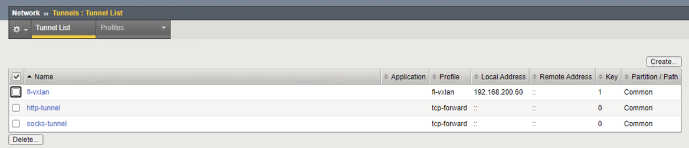
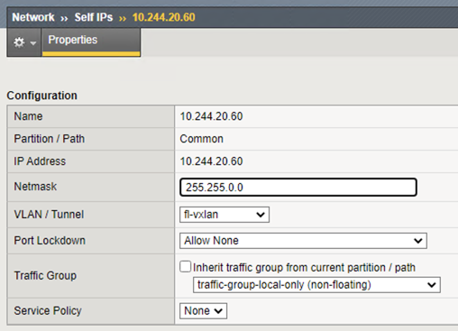

# CIS Installation

## Overview
CIS can be configured for Kubernetes and OpenShift, varying by resources (ConfigMap, Ingress, Routes, CRD, serviceTypeLB), BIG-IP deployment (stand alone, HA), and cluster networking (Flannel/Calico/Cilium/Antrea/OVNKuberentes).

## Prerequisites

These are the mandatory requirements for deploying CIS:

* Kubernetes Cluster must be up and running.

* AS3: 3.18+ must be installed on your BIG-IP system.

* Use the latest TLS version and cipher suites in Kubernetes for kube-api.

* Create a BIG-IP partition to manage Kubernetes objects. This partition can be created either via the GUI (System > Users > Partition List) or via our TMOS CLI:
  ```shell
  create auth partition <cis_managed_partition>
  ```

* You need a user with administrative access to this partition.

* If you need to pull the k8s-bigip-ctlr image from a private Docker registry, store your Docker login credentials as a Secret.

Additionally, if you are using VXLan in Cluster Mode you need to have the following prerequisites. For more information, see [BIG IP Networking with CIS](https://clouddocs.f5.com/containers/latest/userguide/config-options.html#config-options).

* You must have a fully active/licensed BIG-IP. SDN must be licensed. For more information, see BIG-IP VE license support for SDN services.
* VXLan tunnel should be configured from Kubernetes Cluster to BIG-IP. For more information, see [Creating VXLAN Tunnels on Kubernetes Cluster](#Creating-VXLAN-Tunnels-on-Kubernetes-Cluster).

Also consider  [BIG IP Networking with CIS](https://clouddocs.f5.com/containers/latest/userguide/config-options.html#config-options).

For BIG-IP HA, see [Deploying CIS with BIG-IP HA](https://clouddocs.f5.com/containers/latest/userguide/cis-deployment-options.html)

## Installing CIS Using Helm Charts

This is the simplest way to install CIS on OpenShift/Kubernetes cluster. Helm is a package manager for Kubernetes. Helm is Kubernetes version of yum or apt. Helm deploys something called charts, which you can think of as a packaged application. It is a collection of all your versioned, pre-configured application resources which can be deployed as one unit.

* Clone the GitHub repository
  ```shell
  git clone https://github.com/F5Networks/k8s-bigip-ctlr.git
  ```
  
* Download the CA/BIG IP certificate and use it with CIS controller.

  ```shell
  echo | openssl s_client -showcerts -servername <server-hostname>  -connect <server-ip-address>:<server-port> 2>/dev/null | openssl x509 -outform PEM > server_cert.pem
  kubectl create configmap trusted-certs --from-file=./server_cert.pem  -n kube-system
  ```
Alternatively, for non-prod environment you can use ```--insecure=true``` parameter.

**Note:-** If you are updating the BIGIP/CA Certificates, don't miss to rotate them on k8s cluster and restart the CIS.

* Optionally, add BIG-IP credentials as K8S secrets.
    ```shell
    kubectl create secret generic f5-bigip-ctlr-login -n kube-system --from-literal=username=admin --from-literal=password=<password> --from-literal=url=<bigip-uri>
    ```

* Add the CIS chart repository in Helm using following command:
    ```shell
    helm repo add f5-stable https://f5networks.github.io/charts/stable
    ```
* Update the sample-helm-values.yaml ```./docs/config_examples/Install/k8s/sample-helm-values.yaml```
    
* Installing Helm charts
    * Install the Helm chart using the following command if BIG-IP credential secrets are created manually:
      ```shell
      helm install -f values.yaml <new-chart-name> f5-stable/f5-bigip-ctlr
      ```
    * Install the Helm chart with --skip crds if BIG-IP credential secrets are created manually (without Custom Resource Definitions installations):
      ```shell
      helm install --skip-crds -f values.yaml <new-chart-name> f5-stable/f5-bigip-ctlr
      ```
    * If you want to create the BIG-IP credential secret with Helm charts, use the following command:
      ```shell
      helm install --set bigip_secret.create="true" --set bigip_secret.username=$BIGIP_USERNAME --set bigip_secret.password=$BIGIP_PASSWORD -f values.yaml <new-chart-name> f5-stable/f5-bigip-ctlr
      ```

**Note:-** For Kubernetes versions lower than 1.18, please use Helm chart version 0.0.14 as follows: helm install --skip-crds -f values.yaml <new-chart-name> f5-stable/f5-bigip-ctlr --version 0.0.14.

### Chart parameters

| Parameter                                 | Required | Default                      | Description                                                              |
|-------------------------------------------|----------|------------------------------|--------------------------------------------------------------------------|
| `bigip_login_secret`                      | Optional | f5-bigip-ctlr-login          | Secret that contains BIG-IP login credentials.                           |
| `bigip_secret.create`                     | Optional | false                        | Create Kubernetes secret using username and password.                    |
| `bigip_secret.username`                   | Optional | N/A                          | BIG-IP username to create the Kubernetes secret.                         |
| `bigip_secret.password`                   | Optional | N/A                          | BIG-IP password to create the Kubernetes secret.                         |
| `args.bigip_url`                          | Required | N/A                          | The management IP for your BIG-IP device.                                |
| `args.bigip_partition`                    | Required | f5-bigip-ctlr                | BIG-IP partition the CIS Controller will manage.                         |
| `args.namespaces`                         | Optional | N/A                          | List of Kubernetes namespaces which CIS will monitor.                    |
| `rbac.create`                             | Optional | true                         | Create ClusterRole and ClusterRoleBinding.                               |
| `serviceAccount.name`                     | Optional | f5-bigip-ctlr-serviceaccount | Name of the ServiceAccount for CIS controller.                           |
| `serviceAccount.create`                   | Optional | true                         | Create service account for the CIS controller.                           |
| `namespace`                               | Optional | kube-system                  | Name of namespace CIS will use to create deployment and other resources. |
| `image.user`                              | Optional | f5networks                   | CIS Controller image repository username.                                |
| `image.repo`                              | Optional | k8s-bigip-ctlr               | CIS Controller image repository name.                                    |
| `image.pullPolicy`                        | Optional | Always                       | CIS Controller image pull policy.                                        |
| `image.pullSecrets`                       | Optional | N/A                          | List of secrets of container registry to pull image.                     |
| `version`                                 | Optional | latest                       | CIS Controller image tag.                                                |
| `nodeSelector`                            | Optional | N/A                          | Dictionary of Node selector labels.                                      |
| `tolerations`                             | Optional | N/A                          | Array of labels.                                                         |
| `limits_cpu`                              | Optional | 100m                         | CPU limits for the pod.                                                  |
| `limits_memory`                           | Optional | 512Mi                        | Memory limits for the pod.                                               |
| `requests_cpu`                            | Optional | 100m                         | CPU request for the pod.                                                 |
| `requests_memory`                         | Optional | 512Mi                        | Memory request for the pod.                                              |
| `affinity`                                | Optional | N/A                          | Dictionary of affinity.                                                  |
| `securityContext`                         | Optional | N/A                          | Dictionary of deployment securityContext.                                |
| `podSecurityContext`                      | Optional | N/A                          | Dictionary of pod securityContext.                                       |
| `ingressClass.ingressClassName`           | Optional | f5                           | Name of ingress class.                                                   |
| `ingressClass.isDefaultIngressController` | Optional | false                        | CIS will monitor all ingress resources if set to true.                   |
| `ingressClass.create`                     | Optional | true                         | Create ingress class.                                                    |

**Note:-** The parameters bigip_login_secret and bigip_secret are mutually exclusive. If both are defined in the values.yaml file, bigip_secret will be given priority.

### Uninstalling Helm Chart

* Run the command to uninstall the chart.
  ```shell
  helm delete <new-chart> 
  helm repo remove f5-stable
  ```
* Optionally, Run the command to delete the secrets created.
  ```shell
  kubectl delete secret f5-bigip-ctlr-login -n kube-system
  ```
* Delete the trusted certs configMap
  ```shell
  kubectl delete configmap trusted-certs -n kube-system
  rm -rf server_cert.pem
  ```
  
## Installing CIS Manually

* Clone the GitHub repository
  ```shell
  git clone https://github.com/F5Networks/k8s-bigip-ctlr.git
  ```
* Download the CA/BIG IP certificate and use it with CIS controller.

  ```shell
  echo | openssl s_client -showcerts -servername <server-hostname>  -connect <server-ip-address>:<server-port> 2>/dev/null | openssl x509 -outform PEM > server_cert.pem
  kubectl create configmap trusted-certs --from-file=./server_cert.pem  -n kube-system
  ```
Alternatively, for non-prod environment you can use ```--insecure=true``` parameter.

**Note:-** If you are updating the BIGIP/CA Certificates, don't miss to rotate them on k8s cluster and restart the CIS.

* Create a Cluster Role, Cluster Role Binding and Service account for CIS Controller

  ```shell
  kubectl create -f ./docs/config_examples/rbac/k8s_rbac.yml
  ```

**Note:-** The command has the broadest supported permission set. You can narrow the permissions down to specific resources, namespaces, etc. to suit your needs. See the [Kubernetes RBAC documentation](https://kubernetes.io/docs/reference/access-authn-authz/rbac/) for more information.

**Important:** You can substitute a Role and RoleBinding if your Controller does not need access to the entire Cluster.

* Optionally, Install Custom Resource Definitions for CIS Controller if you are using [custom resources](https://clouddocs.f5.com/containers/latest/userguide/crd/) or [nextGen Routes](https://clouddocs.f5.com/containers/latest/userguide/next-gen-routes/) or [multi-cluster](https://clouddocs.f5.com/containers/latest/userguide/multicluster/)

  ```shell
    export CIS_VERSION=<cis-version>
    # For example
    # export CIS_VERSION=v2.20.0
    # or
    # export CIS_VERSION=2.x-master
    # the latter if using a CIS image with :latest label
    kubectl create -f https://raw.githubusercontent.com/F5Networks/k8s-bigip-ctlr/${CIS_VERSION}/docs/config_examples/customResourceDefinitions/customresourcedefinitions.yml
  ```

* Create the kubernetes secret with BIG IP credentials

  ```shell
  kubectl create secret generic f5-bigip-ctlr-login -n kube-system --from-literal=username=admin --from-literal=password=<password> --from-literal=url=<bigip-uri> 
  ```

* Update the CIS deployment file with required image and [config parameters](https://clouddocs.f5.com/containers/latest/userguide/config-parameters.html) and install the CIS Controller.

  ```shell
  kubectl create -f ./docs/config_examples/Install/k8s/sample-k8s-bigip-ctlr.yaml
  ```


### Uninstalling CIS

* To uninstall CIS, run the following commands:

  ```shell
  kubectl delete -f ./docs/config_examples/Install/k8s/sample-k8s-bigip-ctlr.yaml
  kubectl delete -f ./docs/config_examples/customResourceDefinitions/customresourcedefinitions.yml
  kubectl delete -f ./docs/config_examples/rbac/k8s_rbac.yml
  ```

* Optionally, Run the command to delete the secrets created.

  ```shell
  kubectl delete secret f5-bigip-ctlr-login -n kube-system
  ```
* Delete the trusted certs configMap
  ```shell
  kubectl delete configmap trusted-certs -n kube-system
  rm -rf server_cert.pem
  ```

## Creating VXLAN Tunnels on Kubernetes Cluster
This section is required only if you plan to use CIS in a ClusterIP Deployment with VXLan. See [BIG IP Networking with CIS](https://clouddocs.f5.com/containers/latest/userguide/config-options.html#config-options) for more information.

This configuration is for Standalone BIG-IP.
* Log in to BIG-IP and create a partition called kubernetes for CIS.
  ```shell
  tmsh create auth partition kubernetes
  ```
* Create a VXLAN profile.
  ```shell
  tmsh create net tunnels vxlan fl-vxlan port 8472 flooding-type none
  ```
* Create a VXLAN tunnel.
  ```shell
  tmsh create net tunnels tunnel fl-vxlan key 1 profile fl-vxlan local-address 192.168.200.60
  ```
  
* Create the VXLAN tunnel self IP.
  ```shell
  tmsh create net self 10.244.20.60 address 10.244.20.60/255.255.0.0 allow-service none vlan fl-vxlan
  ```
  
* Save the configuration.
  ```shell
  tmsh save sys config
  ```
* Before deploying CIS in ClusterIP mode, you need to configure BIG-IP as a node in the Kubernetes cluster. To do so you will need to modify ```./docs/config_examples/Install/k8s/bigip-node.yaml``` with the MAC address auto-created from the previous steps. From the jumpbox terminal, run the following command at bigip1. Copy the displayed MAC Address.
  ```shell
  tmsh show net tunnels tunnel k8s-tunnel all-properties
  ```
* Update the MAC address obtained in ```./docs/config_examples/Install/k8s/bigip-node.yaml```
* Create the BIG-IP node:
  ```shell
  kubectl create -f ./docs/config_examples/Install/k8s/bigip-node.yaml
  ```
* Verify “bigip1” node is created:
  ```shell
  kubectl get nodes
  ```