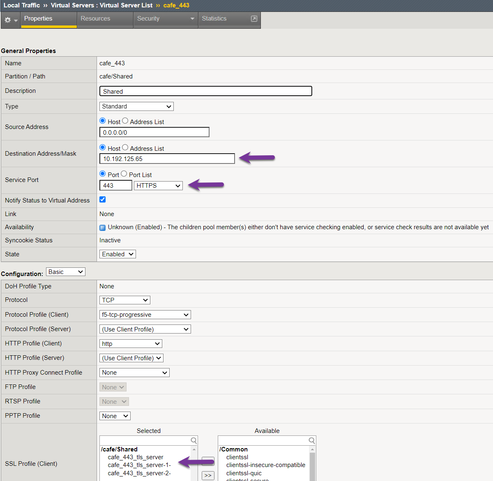
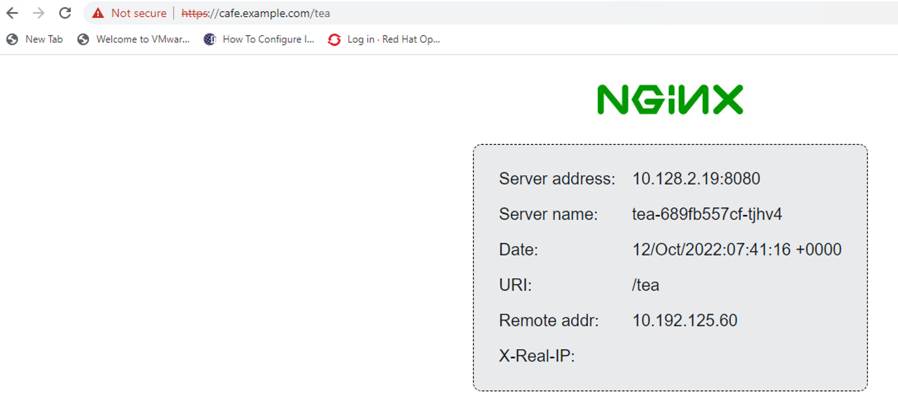

# OpenShift OVN-Kubernetes using F5 BIG-IP HA with NO Tunnels

This document demonstrates how to use **OVN-Kubernetes with F5 BIG-IP HA Routes** to Ingress traffic without using an Overlay. Using OVN-Kubernetes with F5 BIG-IP Routes removes the complexity of creating VXLAN tunnels or using Calico. This document demonstrates **High Availability (HA) BIG-IP's working with OVN-Kubernetes**. Diagram below demonstrates a OpenShift Cluster with three masters and three worker nodes. The three applications; **tea,coffee and mocha** are deployed in the **cafe** namespace.


Demo on YouTube [video](https://youtu.be/Hzz_UFzU7UA)

### Step 1: Deploy OpenShift using OVNKubernetes

Deploy OpenShift Cluster with **networktype** as **OVNKubernetes**. Change the default to **OVNKubernetes** in the install-config.yaml before creating the cluster


### Step 2: Deploy extended ConfigMap

extended ConfigMap provides control to the admin to create and maintain the resource configuration centrally.

* Clone the GitHub repository
  ```shell
  git clone https://github.com/F5Networks/k8s-bigip-ctlr.git
  ```
* Modify the extended Config map and create the extended ConfigMap
  ```shell
  oc create -f docs/config_examples/Install/openshift/quick-start-guides/HA/next-gen-route/route/global-cm.yaml
  ```


### Step 3: Deploy CIS for each BIG-IP

F5 Controller Ingress Services (CIS) called **Next Generation Routes Controller**. Next Generation Routes Controller extended F5 CIS to use multiple Virtual IP addresses. Before F5 CIS could only manage one Virtual IP address per CIS instance.

* Download the CA/BIG IP certificate and use it with CIS controller.
  ```shell
  echo | openssl s_client -showcerts -servername <server-hostname>  -connect <server-ip-address>:<server-port> 2>/dev/null | openssl x509 -outform PEM > server_cert.pem
  oc create configmap trusted-certs --from-file=./server_cert.pem -n kube-system
  ```

Alternatively, for non-prod environment you can use ```--insecure=true``` parameter.

**Note:-** If you are updating the BIGIP/CA Certificates, don't miss to rotate them on k8s cluster and restart the CIS.

* Install the RBAC for CIS Controller
  ```shell
  oc create -f ./docs/config_examples/rbac/openshift_rbac.yaml
  ```

* Install Custom Resource Definitions for CIS Controller.
  ```shell
  export CIS_VERSION=<cis-version>
  # For example
  # export CIS_VERSION=v2.20.0
  # or
  # export CIS_VERSION=master
  # the latter if using a CIS image with :latest label
  oc create -f https://raw.githubusercontent.com/F5Networks/k8s-bigip-ctlr/${CIS_VERSION}/docs/config_examples/customResourceDefinitions/customresourcedefinitions.yml
  ```

* Create the Openshift secret with BIG IP credentials for BIG-IP 01
  ```shell
  oc create secret generic bigip-1-creds -n kube-system --from-literal=username=admin --from-literal=password=admin --from-literal=url=10.192.125.60
  ```

* Create the Openshift secret with BIG IP credentials for BIG-IP 02
  ```shell
  oc create secret generic bigip-2-creds -n kube-system --from-literal=username=admin --from-literal=password=admin --from-literal=url=10.192.125.61
  ```

* * Update the CIS deployment file with required image and [config parameters](https://clouddocs.f5.com/containers/latest/userguide/config-parameters.html) and install the CIS Controller.
    ```shell
    oc create -f docs/config_examples/Install/openshift/quick-start-guides/HA/next-gen-route/cis/f5-bigip-ctlr-01-deployment.yaml
    oc create -f docs/config_examples/Install/openshift/quick-start-guides/HA/next-gen-route/cis/f5-bigip-ctlr-02-deployment.yaml
    ```

CIS [repo](./next-gen-route/cis)

Validate both CIS instances are running

  ```
  # oc get pod -n kube-system
  NAME                                            READY   STATUS    RESTARTS   AGE
  k8s-bigip-ctlr-01-deployment-7cc8b7cf94-2csz7   1/1     Running   0          16s
  k8s-bigip-ctlr-02-deployment-5c8d8c4676-hjwpr   1/1     Running   0          16s
  ```

### Step 4 Deploy the sample application on OpenShift
  ```
  oc create -f docs/config_examples/Install/openshift/quick-start-guides/demo-app/cafe/
  ```
### Step 5 Creating OpenShift Routes for cafe.example.com

Use-case for the OpenShift Routes:

- Edge Termination
- Backend listening on PORT 8080

Create OpenShift Routes

  ```
  oc create -f ./docs/config_examples/Install/openshift/quick-start-guides/HA/next-gen-route/route/cafe/secure
  ```

Routes [repo](./next-gen-route/route/cafe/secure)

Validate OpenShift Routes using the BIG-IP


Validate OpenShift Virtual IP using the BIG-IP



Validate OpenShift Routes policies on the BIG-IP


Validate OpenShift Routes policies by connecting to the Public IP



**Note**:
* Configuration listed above is validated on OCP 4.18