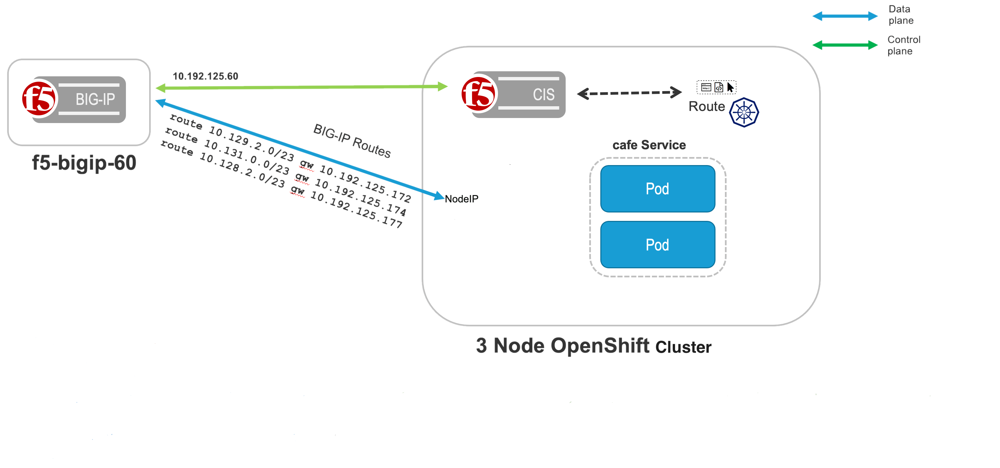
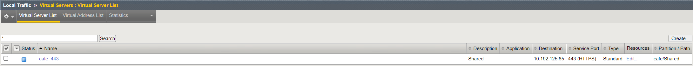
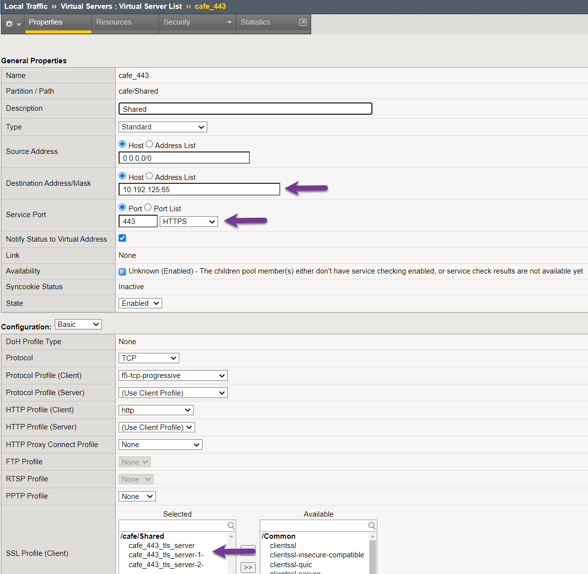
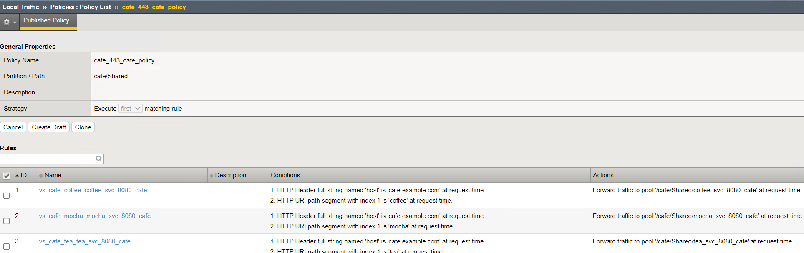
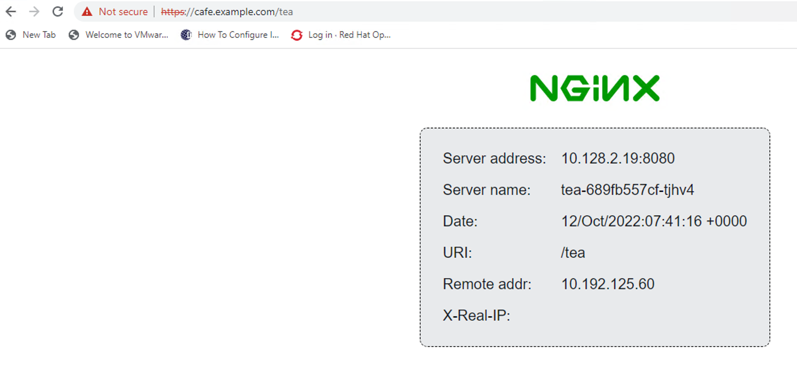

# OpenShift OVN-Kubernetes using F5 BIG-IP with NO Tunnels

This document demonstrates how to use **OVN-Kubernetes with F5 BIG-IP Routes** to Ingress traffic without using an Overlay. Using OVN-Kubernetes with F5 BIG-IP Routes removes the complexity of creating VXLAN tunnels or using Calico. This document demonstrates **Standalone BIG-IP working with OVN-Kubernetes**. Diagram below demonstrates a OpenShift Cluster with three masters and three worker nodes. The three applications; **tea,coffee and mocha** are deployed in the **cafe** namespace.



Demo on YouTube [video](https://youtu.be/_q603YFG5TU)

### Step 1: Deploy OpenShift using OVNKubernetes

Deploy OpenShift Cluster with **networktype** as **OVNKubernetes**. Change the default to **OVNKubernetes** in the install-config.yaml before creating the cluster

### Step 2: Deploy extended ConfigMap

extended ConfigMap provides control to the admin to create and maintain the resource configuration centrally.

* Clone the GitHub repository
  ```shell
  git clone https://github.com/F5Networks/k8s-bigip-ctlr.git
  ```
* Modify the extended Config map and create the extended ConfigMap
  ```shell
  oc create -f ./docs/config_examples/Install/openshift/quick-start-guides/StandAlone/next-gen-route/global-cm.yaml
  ```

### Step 3: Deploy CIS

F5 Controller Ingress Services (CIS) called **Next Generation Routes Controller**. Next Generation Routes Controller extended F5 CIS to use multiple Virtual IP addresses. Before F5 CIS could only manage one Virtual IP address per CIS instance.

* Download the CA/BIG IP certificate and use it with CIS controller.
  ```shell
  echo | openssl s_client -showcerts -servername <server-hostname>  -connect <server-ip-address>:<server-port> 2>/dev/null | openssl x509 -outform PEM > server_cert.pem
  oc create configmap trusted-certs --from-file=./server_cert.pem -n kube-system
  ```

Alternatively, for non-prod environment you can use ```--insecure=true``` parameter.

**Note:-** If you are updating the BIGIP/CA Certificates, don't miss to rotate them on k8s cluster and restart the CIS.

* Install the RBAC for CIS Controller
  ```shell
  oc create -f ./docs/config_examples/rbac/openshift_rbac.yaml
  ```

* Install Custom Resource Definitions for CIS Controller.
  ```shell
  export CIS_VERSION=<cis-version>
  # For example
  # export CIS_VERSION=v2.20.0
  # or
  # export CIS_VERSION=master
  # the latter if using a CIS image with :latest label
  oc create -f https://raw.githubusercontent.com/F5Networks/k8s-bigip-ctlr/${CIS_VERSION}/docs/config_examples/customResourceDefinitions/customresourcedefinitions.yml
  ```

* Create the Openshift secret with BIG IP credentials

  ```shell
  oc create secret generic f5-bigip-ctlr-login -n kube-system --from-literal=username=admin --from-literal=password=admin --from-literal=url=10.192.125.60
  ```
  
* Update the CIS deployment file with required image and [config parameters](https://clouddocs.f5.com/containers/latest/userguide/config-parameters.html) and install the CIS Controller.
  ```shell
  oc create -f ./docs/config_examples/Install/openshift/quick-start-guides/StandAlone/f5-k8s-bigip-ctlr-openshift.yaml
  ```

### Step 5 Creating OpenShift Routes for cafe.example.com

User-case for the OpenShift Routes:

- Edge Termination
- Backend listening on PORT 8080

Create OpenShift Routes

```
oc create -f route-tea-edge.yaml
oc create -f route-coffee-edge.yaml
oc create -f route-mocha-edge.yaml
```

Routes [repo](./route/cafe/secure)

Validate OpenShift Routes using the BIG-IP



Validate OpenShift Virtual IP using the BIG-IP



Validate OpenShift Routes policies on the BIG-IP



Validate OpenShift Routes policies by connecting to the Public IP



**Note**:
* Configuration listed above is validated on OCP 4.18