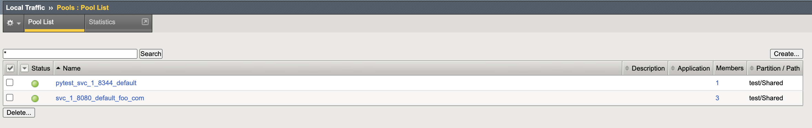
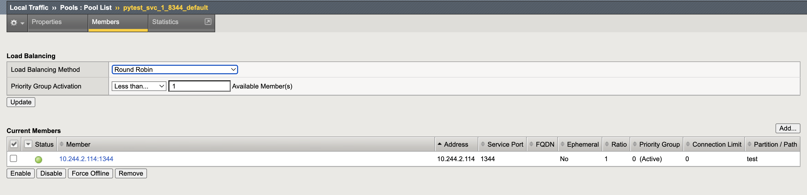
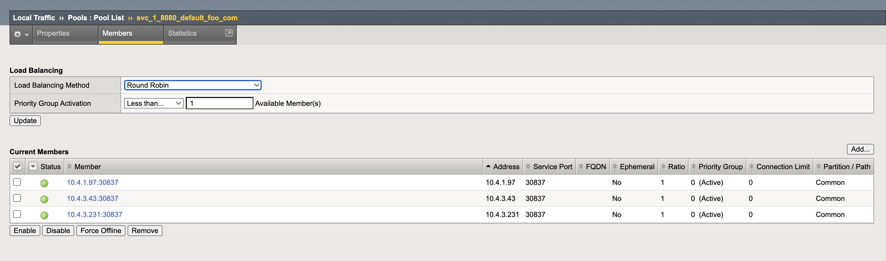

## Pool Member Type - auto
If CIS is configured with the "auto" mode, CIS will learn the respective service type of the CIS monitored resources and populate the bigip pool members based on the service types<br>
In other words, CIS considers the pool-mode as "cluster" when the respective service type is "clusterIP" and considers the pool-mode as "nodeport" when the respective service type are "NodePort" and "LoadBalancer"<br> 
"auto" pool-mode can be considered as the combination of "nodeport" and "cluster". It adjusts the modes automatically based on the service Type. 
## Configuration
```
   args:
     --pool-member-type=auto
```

# Supported Services
CIS in auto mode will learn the service types and process the pool members. Below service types are supported 
with the respective pool member types

| CIS version | Service Type | Pool Members                                  | VXLan Required                          |
|-------------|--------------|-----------------------------------------------|-----------------------------------------|
| 2.16+       | ClusterIP    | Pod IPs   (Same as CIS "cluster" pool-mode)   | Yes(If static routing Mode not enabled) |
| 2.16+       | Headless     | Pod IPs   (Same as CIS "cluster" pool-mode)   | Yes(If static routing Mode not enabled) |
| 2.16+       | NodePort     | Node IP's (Same as CIS "nodeport" pool-mode)  | N/A                                     |
| 2.16+       | LoadBalancer | Node IP's (Same as CIS "nodeport" pool-mode)  | N/A                                     |

  
**Note:** 

* For the combination of auto pool mode enabled & static routing mode disabled, VxLAN Config is required to enable traffic to cluster type services(pods)
* For Headless service - service type will be ClusterIP. So pod IP will be configured on the BIG IP
* pool-member-type=auto is supported only with CRD's and NextGen


**Example:**

Let's assume we have 2 services. One is of type ClusterIP and other is of type NodePort   
When we run the CIS in the auto mode we will see below results on the BIGIP.


## Service - 1
```
apiVersion: v1
kind: Service
metadata:
  labels:
    app: pytest-svc-1
  name: pytest-svc-1
  namespace: default
spec:
  clusterIP: 10.110.147.19
  clusterIPs:
  - 10.110.147.19
  internalTrafficPolicy: Cluster
  ipFamilies:
  - IPv4
  ipFamilyPolicy: SingleStack
  ports:
  - name: pytest-svc-1-8344
    port: 8344
    protocol: TCP
    targetPort: 1344
  selector:
    app: pytest-svc-1
  sessionAffinity: None
  type: ClusterIP
status:
  loadBalancer: {} 
```

## Service - 2
```
apiVersion: v1
kind: Service
metadata:
  labels:
    app: svc-1
  name: svc-1
  namespace: default
spec:
  clusterIP: 10.100.246.74
  clusterIPs:
  - 10.100.246.74
  externalTrafficPolicy: Cluster
  internalTrafficPolicy: Cluster
  ipFamilies:
  - IPv4
  ipFamilyPolicy: SingleStack
  ports:
  - name: svc-1-80
    nodePort: 30837
    port: 8080
    protocol: TCP
    targetPort: 80
  selector:
    app: svc-1
  sessionAffinity: None
  type: NodePort
status:
  loadBalancer: {}
  
```

## Pools on BGIP




## pytest-svc-1 Pool Members on BIGIP



**Note:**

* Service - pytest-svc-1 is of type ClusterIP, CIS will populate pool with the pod IP


## svc-1 Pool Members on BIGIP


**Note:**

* Service - svc-1 is of type NodePort, CIS will populate pool with the Node IP
