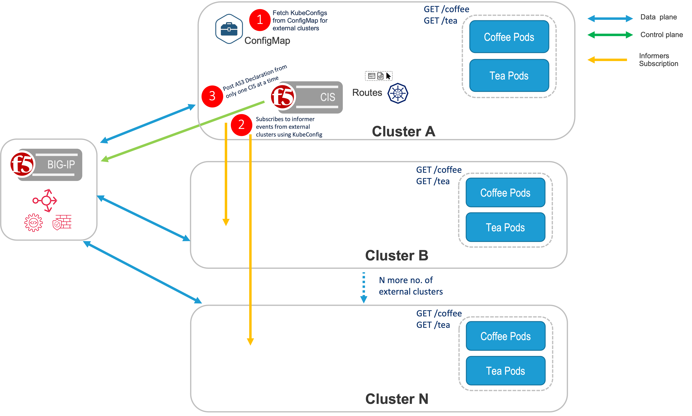
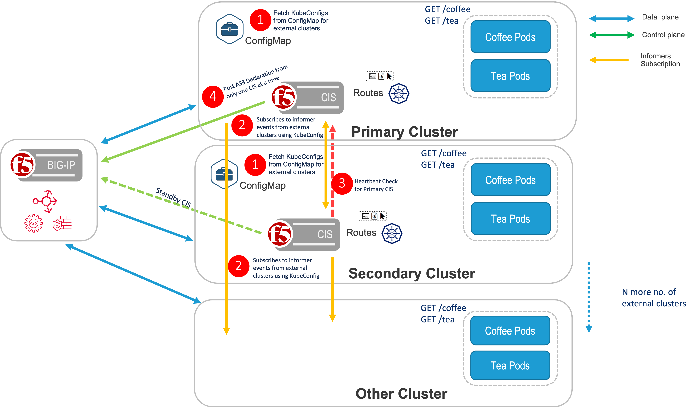

# OpenShift/Kubernetes Multi-Cluster

This page documents the multi cluster support in CIS. Check the Known Issues section for more information on features not supported.

## Contents

[Overview](#overview)

[Topologies](#topologies)

[Configuration](#configuration)

[ExtendedSpecConfigMap](#extendedspecconfigmap)

[Known Issues](#known-issues)

[FAQ](#faq)


## Overview

Multi-Cluster Support in CIS allows users to expose multiple apps spread across OpenShift/Kubernetes clusters using a single BIG-IP Virtual Server. An app can be deployed different OpenShift clusters exposing them using a route resource. Using a Multi-Cluster implementation the CIS can be deployed in a HA topology, or Standalone CIS, to expose the apps spread across OpenShift clusters.


**Note**: 
* CIS supports processing of routes in traditional way as well as with NextGen Controller and with Multi-Cluster support.
* Currently, nodePort is supported.Cluster mode is supported with static route configuration on BIGIP(No tunnels)

## Prerequisites
* Cluster node, where CIS is deployed, should be able to reach the API server of all OpenShift/Kubernetes clusters.
* extendedConfigMap needs to be created to run CIS in Multi-Cluster mode.
* kube-config files for each cluster should be available for CIS to access resources such as Pods/Services/Endpoints/Nodes.

## Topologies

### Standalone CIS

In a Standalone deployment of CIS, CIS is only deployed in one cluster, then create a route resource with a Multi-Cluster annotation or CRD resource with extendedServiceReferences to expose the apps in different OpenShift/K8s clusters.



Below is the sample Multi-Cluster Config in an Extended ConfigMap.
```
  extendedSpec: |
    externalClustersConfig:    -------------------------------------|----------------------------|                            |
    - clusterName: cluster3                                      |                            |
      secret: default/kubeconfig3                                |---> Cluster configs for    |
    - clusterName: cluster4                                      |     all other clusters     |
      secret: default/kubeconfig4                                |     except HA clusters     |
    - clusterName: cluster5                                      |                            |
      secret: default/kubeconfig5  ------------------------------|----------------------------|
    extendedRouteSpec:
    - namespace: foo   -------------------------------------|
      vserverAddr: 10.8.0.4                                 |
      vserverName: nextgenroutes                            |----------------> RouteGroup with namespace
      allowOverride: true                                   |
      bigIpPartition: MultiTenant                           |
      policyCR: default/sample-policy  _____________________|
    - namespace: bar -------------------------------------|
      vserverAddr: 10.8.0.5                               |----------------> RouteGroup with namespace
      allowOverride: false           _____________________|
```
**Note**: extendedRouteSpec is only applicable in case of openshift route resources not for CRD resources.

### High Availability CIS

#### Prerequisites
  * A pair of High Availability OpenShift/Kubernetes clusters should be available, which have the same applications running in both clusters.
  * HealthCheck endpoint should be available to check the health of the primary cluster. Currently, TCP/HTTP Health endpoints are supported.


In HA deployment of CIS, CIS needs to be deployed in both the primary and secondary cluster. Also, the same extendedConfigMap needs to be deployed in both the primary and secondary cluster. 
CIS will look for the same service name in both primary and secondary clusters to expose the application via routes. Additionally, a Multi-Cluster annotation is created in the route definition exposing the applications in the other clusters.

Deploying CIS HA in Two Modes:
 * active-active and active-standby mode are used in case of CIS running in High Availability mode.
 * Based on the provided value the CIS running on Primary cluster decides whether to monitor the workloads running on Secondary Cluster or not.
 * In case of active-active mode CIS running on Primary cluster updates the pool members for Virtual Servers from both the clusters those are part of HA Cluster(Primary and Secondary Clusters) as well as pool members from all other remotely monitored clusters.
 * Whereas in case of active-standby mode CIS running on Primary cluster updates the pool members for Virtual Servers only from Primary Cluster and from all the other remotely monitored clusters except Secondary cluster.
 * However, in case the Primary cluster is down and CIS on the Secondary cluster has taken control then pool member from the Secondary Cluster as well as all other remotely monitored clusters are populated for the Virtual Servers irrespective of the value of HA mode.

**Note:**
 * Additionally, there is another supported mode called "ratio", in which pool members from all the Kubernetes/Openshift clusters are update for the Virtual Server, however the traffic distribution is done based on the ratio values defined for each cluster.
 * Ratio doesn't require CIS to be running in HA environment. It is supported in both CIS HA and non-HA environment.

Below is a tabular representation of the scenarios mentioned above:

###### When Primary Cluster is healthy and CIS is running on it

| HA Mode values | Primary Cluster Pool Members | Secondary Cluster Pool Members | Other remotely monitored clusters Pool Members | Traffic distribution based on ratio |
|----------------|------------------------------|--------------------------------|------------------------------------------------|-------------------------------------|
| active-active  | Yes                          | Yes                            | Yes                                            | No                                  |
| active-standby | Yes                          | No                             | Yes                                            | No                                  |
| ratio          | Yes                          | Yes                            | Yes                                            | Yes                                 |


###### When Primary Cluster is down, which means CIS in Secondary cluster has the control

| HA Mode values | Primary Cluster Pool Members | Secondary Cluster Pool Members | Other remotely monitored clusters Pool Members | Traffic distribution based on ratio |
|----------------|------------------------------|--------------------------------|------------------------------------------------|-------------------------------------|
| active-active  | No                           | Yes                            | Yes                                            | No                                  |
| active-standby | No                           | Yes                            | Yes                                            | No                                  |
| ratio          | Yes                          | Yes                            | Yes                                            | Yes                                 |



Below is the sample Multi-Cluster Configs with HA in Extended ConfigMap.
```
  extendedSpec: |
    mode: active-active       -----------------------------------|---->  HA Mode              |
    highAvailabilityCIS:   --------------------------------------|----------------------------|
      primaryEndPoint: http://10.145.72.114:8001                 |                            |
      probeInterval: 30                                          |                            |
      retryInterval: 3                                           |                            |
      primaryCluster:                                            |---> Cluster configs for    |
        clusterName: cluster1                                    |     High availability      |
        secret: default/kubeconfig1                              |     clusters               |---> Multi-Cluster configs
      secondaryCluster:                                          |                            |
        clusterName: cluster2                                    |                            |
        secret: default/kubeconfig2                              |                            |
    externalClustersConfig:    -------------------------------------|                            |
    - clusterName: cluster3                                      |                            |
      secret: default/kubeconfig3                                |---> Cluster configs for    |
    - clusterName: cluster4                                      |     all other clusters     |
      secret: default/kubeconfig4                                |     except HA clusters     |
    - clusterName: cluster5                                      |                            |
      secret: default/kubeconfig5  ------------------------------|----------------------------|
    extendedRouteSpec:
    - namespace: foo   -------------------------------------|
      vserverAddr: 10.8.0.4                                 |
      vserverName: nextgenroutes                            |----------------> RouteGroup with namespace
      allowOverride: true                                   |
      bigIpPartition: MultiTenant                           |
      policyCR: default/sample-policy  _____________________|
    - namespace: bar -------------------------------------|
      vserverAddr: 10.8.0.5                               |----------------> RouteGroup with namespace
      allowOverride: false           _____________________|
```

Below is the sample Multi-Cluster Configs with HA and Ratio in Extended ConfigMap.
```
  extendedSpec: |
    mode: ratio        ------------------------------------------|----------------------------|
    localClusterRatio: 4                                         |                            |
    highAvailabilityCIS:   --------------------------------------|                            |
      primaryEndPoint: http://10.145.72.114:8001                 |                            |
      probeInterval: 30                                          |                            |
      retryInterval: 3                                           |                            |
      primaryCluster:                                            |---> Cluster configs for    |
        clusterName: cluster1                                    |     High availability      |
        secret: default/kubeconfig1                              |     clusters               |---> Multi-Cluster configs
        ratio: 3                                                 |                            |
      secondaryCluster:                                          |                            |
        clusterName: cluster2                                    |                            |
        secret: default/kubeconfig2                              |                            |
        ratio: 2                                                 |                            |
    externalClustersConfig:    -------------------------------------|                            |
    - clusterName: cluster3                                      |                            |
      secret: default/kubeconfig3                                |---> Cluster configs for    |
      ratio: 2                                                   |     all other clusters     |
    - clusterName: cluster4                                      |     except HA clusters     |
      secret: default/kubeconfig4                                |                            |
    - clusterName: cluster5                                      |                            |
      secret: default/kubeconfig5                                |                            |  
      ratio: 1                     ------------------------------|----------------------------|
    extendedRouteSpec:
    - namespace: foo   -------------------------------------|
      vserverAddr: 10.8.0.4                                 |
      vserverName: nextgenroutes                            |----------------> RouteGroup with namespace
      allowOverride: true                                   |
      bigIpPartition: MultiTenant                           |
      policyCR: default/sample-policy  _____________________|
    - namespace: bar -------------------------------------|
      vserverAddr: 10.8.0.5                               |----------------> RouteGroup with namespace
      allowOverride: false           _____________________|
```
**Note**: extendedRouteSpec is only applicable in case of openshift route resources not for CRD resources.

Below is the sample Multi-Cluster Configs with HA and cluster AdminState in Extended ConfigMap.
```
  extendedSpec: |
    mode: active-active    --------------------------------------|----------------------------|
    highAvailabilityCIS:   --------------------------------------|                            |
      primaryEndPoint: http://10.145.72.114:8001                 |                            |
      probeInterval: 30                                          |                            |
      retryInterval: 3                                           |                            |
      primaryCluster:                                            |---> Cluster configs for    |
        clusterName: cluster1                                    |     High availability      |
        secret: default/kubeconfig1                              |     clusters               |---> Multi-Cluster configs
      secondaryCluster:                                          |                            |
        clusterName: cluster2                                    |                            |
        secret: default/kubeconfig2                              |                            |
        adminState: enable                                       |                            |
    externalClustersConfig:    ----------------------------------|                            |
    - clusterName: cluster3                                      |                            |
      secret: default/kubeconfig3                                |---> Cluster configs for    |
      adminState: disable                                        |     all other clusters     |
    - clusterName: cluster4                                      |     except HA clusters     |
      secret: default/kubeconfig4                                |                            |
    - clusterName: cluster5                                      |                            |
      secret: default/kubeconfig5                                |                            |  
      adminState: offline          ------------------------------|----------------------------|
    extendedRouteSpec:
    - namespace: foo   -------------------------------------|
      vserverAddr: 10.8.0.4                                 |
      vserverName: nextgenroutes                            |----------------> RouteGroup with namespace
      allowOverride: true                                   |
      bigIpPartition: MultiTenant                           |
      policyCR: default/sample-policy  _____________________|
    - namespace: bar -------------------------------------|
      vserverAddr: 10.8.0.5                               |----------------> RouteGroup with namespace
      allowOverride: false           _____________________|
```
**Note**: extendedRouteSpec is only applicable in case of openshift route resources not for CRD resources.

Below is the sample Multi-Cluster Configs with standalone CIS and cluster AdminState in Extended ConfigMap.
```
  extendedSpec: |
    localClusterAdminState: disable  ----------------------------|AdminState for local cluster|
    externalClustersConfig:    ----------------------------------|----------------------------|
    - clusterName: cluster3                                      |                            |
      secret: default/kubeconfig3                                |---> Cluster configs for    |
      adminState: enable                                         |     all other clusters     |
    - clusterName: cluster4                                      |     except HA clusters     |
      secret: default/kubeconfig4                                |                            |
    - clusterName: cluster5                                      |                            |
      secret: default/kubeconfig5                                |                            |  
      adminState: offline          ------------------------------|----------------------------|
    extendedRouteSpec:
    - namespace: foo   -------------------------------------|
      vserverAddr: 10.8.0.4                                 |
      vserverName: nextgenroutes                            |----------------> RouteGroup with namespace
      allowOverride: true                                   |
      bigIpPartition: MultiTenant                           |
      policyCR: default/sample-policy  _____________________|
    - namespace: bar -------------------------------------|
      vserverAddr: 10.8.0.5                               |----------------> RouteGroup with namespace
      allowOverride: false           _____________________|
```
**Note**: localClusterAdminState is only applicable in case of standalone CIS. It's ignored if specified in HA CIS mode. 


## Configuration

### Openshift Routes with multi-cluster

### CIS Deployment Parameter

If you are using multi-cluster mode, ```--multi-cluster-mode``` parameter is a required parameter.


| Parameter          | Type   | Required | Description                                                                                                    | Allowed Values                     |
|--------------------|--------|----------|----------------------------------------------------------------------------------------------------------------|------------------------------------|
| multi-cluster-mode | String | Required | Specify whether CIS is running standalone or as primary/secondary in the case of a high availability topology. | standalone or primary or secondary |

**Note**: Here **standalone** refers to standalone topology of CIS deployment, See [Standalone CIS](#standalone-cis).

Following is the sample deployment for primary CIS deployment:

```yaml
    spec:
      containers:
      - args:
        - --bigip-partition
        - <partition>
        - --bigip-url
        - <ip-address>
        - --bigip-username
        - <user-name>
        - --bigip-password
        - <password>
        - --log-level
        - DEBUG
        - --insecure
        - --controller-mode=openshift
        - --extended-spec-configmap=kube-system/extended-spec-config
        - --route-label=systest
        - --pool-member-type
        - nodeport
        - --multi-cluster-mode=primary
        command:
        - /app/bin/k8s-bigip-ctlr
        image: <image-name>
```

**Note:** 
1. Update the ```multi-cluster-mode``` to *secondary* for secondary CIS deployment in high availablility topology, See [High Availability CIS](#high-availability-cis). 
2. Update the ```multi-cluster-mode``` to *standalone* for standalone topology, See [Standalone CIS](#standalone-cis).

### extended ConfigMap Parameters

#### externalClustersConfig Parameters

| Parameter   | Type   | Required  | Description                                                               | Default | Examples                |
|-------------|--------|-----------|---------------------------------------------------------------------------|---------|-------------------------|
| clusterName | String | Mandatory | Name of the cluster                                                       | -       | cluster1                |
| secret      | String | Mandatory | Name of the secret created for kubeconfig (format: namespace/secret-name) | -       | test/secret-kubeconfig1 |
| ratio       | int    | Optional  | Ratio at which the traffic has to be distributed over clusters            | 1       | 3                       |
| adminState  | String | Optional  | adminState can be used to disable/enable/offline clusters           | 1       | 3                       |


**Note:** Avoid specifying HA cluster(Primary/Secondary cluster) configs in externalClustersConfig.

#### High Availability Mode (Optional parameter)
| Parameter              | Type    | Required  | Description                                                         | Default        | Examples       |
|------------------------|---------|-----------|---------------------------------------------------------------------|----------------|----------------|
| mode                   | Object  | Optional  | Type of high availability mode (active-active/active-standby/ratio) | active-standby | active-active  |

Specifies whether the CIS HA cluster is configured with active-active mode, active-standby mode or ratio mode.
* If mode Type: active-active, CIS fetches service from both the HA clusters whenever it's referenced in Route Spec.
* If mode Type: active-standby (default), CIS fetches service from only the local cluster whenever it's referenced in a Route Spec.
* If mode Type: ratio, CIS works in active-active mode and, it splits traffic according to the ratio specified for each cluster.

#### Local cluster ratio (Optional parameter)
| Parameter              | Type | Required  | Description                                                                                               | Default | Examples |
|------------------------|------|-----------|-----------------------------------------------------------------------------------------------------------|---------|----------|
| localClusterRatio      | Int  | Optional  | Ratio for the local cluster where CIS is running(specify only when using ratio in CIS non-HA environment) | 1       | 3        |
**Note:** It is not needed in case of using ratio in CIS HA environment, as ratio of Primary cluster does the same thing. If specified in this scenario then it will be ignored.

#### highAvailabilityCIS Parameters

| Parameter              | Type    | Required  | Description                                                             | Default | Examples                  |
|------------------------|---------|-----------|-------------------------------------------------------------------------|---------|---------------------------|
| primaryClusterEndPoint | String  | Mandatory | Endpoint to check health of primary cluster                             | -       | http://10.145.72.114:8001 |
| probeInterval          | Integer | Optional  | Time interval between health check (in seconds)                         | 60      | 30                        |
| retryInterval          | Integer | Optional  | Time interval between recheck when primary cluster is down (in seconds) | 15      | 3                         |
| primaryCluster         | Object  | Mandatory | Primary cluster config                                                  | -       | -                         |
| secondaryCluster       | Object  | Mandatory | Secondary cluster config                                                | -       | -                         |


##### primaryCluster/secondaryCluster Parameters

| Parameter   | Type   | Required  | Description                                                               | Default | Examples                |
|-------------|--------|-----------|---------------------------------------------------------------------------|---------|-------------------------|
| clusterName | String | Mandatory | Name of the cluster                                                       | -       | cluster1                |
| secret      | String | Mandatory | Name of the secret created for kubeconfig (format: namespace/secret-name) | -       | test/secret-kubeconfig1 |
| ratio       | int    | Optional  | Ratio at which the traffic has to be distributed over clusters            | 1       | 3                       |
| adminState  | String | Optional  | adminState can be used to disable/enable/offline clusters           | 1       | 3                       |


**Note**: In order to run CIS in high availability mode, multi-cluster-mode parameter (primary/secondary) needs to be set in the CIS deployment arguments.
* It's recommended to provide both primaryCluster and secondaryCluster configs in the extendedConfigMap.
* If no traffic has to be forwarded to a specific cluster then set the ratio field to 0.

##### CIS Primary Cluster Endpoint
 
Health probe parameters are provided in highAvailabilityCIS in extended configmap, helping to ensure high availability of CIS. CIS running in secondary cluster continuously monitors the health of the primary cluster. If it's down, then the secondary CIS takes the responsibility of posting declarations to BIG-IP.

**Note**: primaryEndPoint is a mandatory parameter if CIS is intended to run in Multi-Cluster HA mode. If this is not specified the secondary CIS will not run.


### Route Annotation for Multi-ClusterServices
Services running in any other OpenShift clusters, apart from the HA cluster pair, can be referenced in the route annotations as mentioned below:
```
virtual-server.f5.com/multiClusterServices: 
'[
     {
         "clusterName": "cluster2", 
         "serviceName": "svc-pytest-foo-1-com",
         "namespace": "foo", 
         "port": 80,
         "weight": 30,
     }
]'
```
### CRD Resources with Multi-Cluster

### CIS Deployment Parameter

**Note**: Here **standalone** refers to standalone topology of CIS deployment, See [Standalone CIS](#standalone-cis).

Following is the sample deployment for primary CIS deployment:

```yaml
    spec:
      containers:
      - args:
        - --bigip-partition
        - <partition>
        - --bigip-url
        - <ip-address>
        - --bigip-username
        - <user-name>
        - --bigip-password
        - <password>
        - --log-level
        - DEBUG
        - --insecure
        - --custom-resource-mode=true
        - --extended-spec-configmap=kube-system/extended-spec-config
        - --pool-member-type
        - nodeport
        - --multi-cluster-mode=primary
        command:
        - /app/bin/k8s-bigip-ctlr
        image: <image-name>
```

**Note:**
1. Update the ```multi-cluster-mode``` to *secondary* for secondary CIS deployment in high availablility topology, See [High Availability CIS](#high-availability-cis).
2. Update the ```multi-cluster-mode``` to *standalone* for standalone topology, See [Standalone CIS](#standalone-cis).

**Note**: _weight_ needs to be specified onlyonly in A/B scenario
### Virutal Server Pool with Multi-ClusterServices
Services running in any other OpenShift/Kubernetes clusters, apart from the HA cluster pair, can be referenced in the VS Pool as mentioned below:
```
  pools:
  - path: /tea
    serviceNamespace: tea
    service: svc-2
    servicePort: 80
    extendedServiceReferences:
    - clusterName: cluster2
      namespace: ns1
      port: 8080
      serviceName: svc-1
    - clusterName: cluster3
      namespace: ns2
      port: 80
      serviceName: svc-ext-1
```

### Transport Server Pool with Multi-ClusterServices
Services running in any other OpenShift/Kubernetes clusters, apart from the HA cluster pair, can be referenced in the TS Pool as mentioned below:
```
  pool:
    service: svc-1
    servicePort: 8181
    extendedServiceReferences:
    - clusterName: cluster2
      serviceName: svc-1
      namespace: ns1
      port: 8181
    - clusterName: cluster3
      serviceName: svc-ext-1
      namespace: ns2
      port: 8282
```

## Static Routing Mode
CIS supports configuring static routes in BIG-IP with node subnets assigned for the nodes in the OpenShift/k8s cluster.This enables direct routing from BIGIP to k8s Pods in cluster mode without vxaln tunnel configuration on BIGIP.

### Configuration
To enable the static route configuration, set --static-routing-mode to true and --orchestration-cni to CNI configured in the cluster.

| Parameter            | Type    | Required  | Description                                                                                          | Allowed values                     | Default | Agent |
|----------------------|---------|-----------|------------------------------------------------------------------------------------------------------|------------------------------------|---------|-------|
| static-routing-mode  | Boolean | Optional  | Adds Static Routes on the BIGIP so that traffic can be directly route to the pods. (Without tunnels) | true,false                         | false   | AS3   |
| orchestration-cni    | string  | Optional	 | Kubernetes Cluster CNI Name                                                                          | cilium-k8s, flannel,ovn-k8s,antrea | flannel | AS3   |
| shared-static-routes | Boolean | Optional  | flag to enable configuration of static routes on bigip in common partition                           | true,false                         | false   | AS3   |

### CIS Deployment Parameter

**Note**: Here **standalone** refers to standalone topology of CIS deployment, See [Standalone CIS](#standalone-cis).

Following is the sample deployment for primary CIS deployment:

```yaml
    spec:
      containers:
      - args:
        - --bigip-partition
        - <partition>
        - --bigip-url
        - <ip-address>
        - --bigip-username
        - <user-name>
        - --bigip-password
        - <password>
        - --log-level
        - DEBUG
        - --insecure
        - --custom-resource-mode=true
        - --static-routing-mode=true
        - --orchestration-cni=ovn-k8s
        - --shared-static-routes=true
        - --extended-spec-configmap=kube-system/extended-spec-config
        - --pool-member-type
        - cluster
        - --multi-cluster-mode=primary
        command:
        - /app/bin/k8s-bigip-ctlr
        image: <image-name>
```

#### Route Annotation / VS or TS MultiClusterServices Parameters

| Parameter   | Type       | Required   | Description                                             | Default | Examples |
|-------------|------------|------------|---------------------------------------------------------|---------|----------|
| clusterName | String     | Mandatory  | Name of the cluster                                     | -       | cluster1 |
| serviceName | String     | Mandatory  | Name of the service                                     | -       | svc-1    |
| namespace   | String     | Mandatory  | Namespace where the service is created                  | -       | test     |
| port        | String/Int | Mandatory  | port of the service  (for named port use string value ) | -       | 80       |
| weight      | Int        | Optional   | weight to be used for traffic splitting                 | 0       | 20       |

### Cluster wise Ratio for traffic distribution
CIS supports distribution of traffic across clusters as per the ratio configured for each cluster in the extended ConfigMap.<br>
It works even along with A/B where different weights are defined for each service. In such a case the ratio of traffic 
distribution is computed taking into consideration both the service weights and cluster ratio.<br>
However, the ratio of the clusters those haven't hosted any services linked to the concerned route are not taken into consideration 
while computing the final ratio.<br>

**Note:** 
* Cluster wise ratio for traffic distribution is supported in HA as well as non-HA CIS environment.
* Ratio is only supported for NextGen Routes and Virtual Server CR.
* Setting cluster adminState in conjunction with cluster ratio will affect the overall traffic distribution across clusters.
  As the clusters marked as disable or offline will not receive traffic, so any ratio defined for these clusters will be rendered ineffective.
  Thus, in such a scenario it's recommended to set the cluster ratio to 0 for all the clusters marked with disable/offline.

### Cluster adminState to enable/disable/offline a cluster
adminState can be provided for a cluster to dictate the state of a particular cluster.
Supported values for adminState are [enable, disable, offline]<br>
By default clusters are in enabled state.<br>
**adminState: enable**, all new connections are allowed to the pool members from the cluster.<br>
**adminState: disable**, all new connections except those which match an existing persistence session are not allowed for the pool members from the cluster.<br>
**adminState: offline**, no new connections are allowed to the pool members from the cluster, even if they match an existing persistence session.

## Known issues
*  Pool members are not getting populated for extended service in ratio mode
*  CIS doesn't update pool members if service doesn't exist in primary cluster but exists in secondary cluster for Route.
*  CIS on start up in multiCluster mode, if any external cluster kube-api server is down/not reachable, CIS is struck and not processing any valid clusters config also.Workaround to remove unreachable cluster config from configmap and restart CIS
*  CIS fails to post declaration with VS with health monitors in ratio mode.Issue is observed intermittently
*  Route status is not updated in other HA cluster. For eg: Active Primary CIS cluster doesn't update the route status in Secondary HA cluster and vice-versa.
*  CIS on switch over from ratio to active-standby mode, doesn't add the external cluster services. Any change to mode, it is always recommended to restart the CIS

## FAQ

### Is --multi-cluster-mode is a required parameter for Multi-Cluster support?
Yes. Multi-Cluster support only works if --multi-cluster-mode is defined in CIS deployment.

### Is extended configMap mandatory for Multi-Cluster support?
Yes. Multi-Cluster support only works with extended configmap.

### Does extended configmap update require CIS restart?
No. It's recommended to restart CIS if any HA configuration or external cluster configurations are updated in extended Configmap. However CIS restart is not required when updating ratio in the extended Configmap.

### Does mode update require CIS restart?
Yes. CIS has to be restarted when there is a change in the mode. 

### How do you add a new cluster?
To add a new cluster, create a kube-config file with read only permissions. Then create a Kubernetes secret using the kube-config file. Refer this in secret in the extended ConfigMap to add the new cluster.
CIS dynamically reads the new kube-config of the new cluster and starts listening to the services and endpoints in the new cluster when a route refers this new cluster.

### Where do you manage the manifest or Configuration Objects like Routes, Configmaps etc.?
Manifests or Configuration objects are managed centralized in Primary Cluster and if HA is desired the same manifests are expected to be in Secondary Cluster.

### What are the supported CNIs?
Currently, NodePort mode is supported.For cluster mode, static routing mode is supported to enable configuration of static routes on bigip for pod network subnets for direct routing from BIGIP to k8s Pods

### What kind of providers are supported?
CIS supports Hybrid Cloud, any public Cloud providers such as; AWS, Azure, GCP, On-Prem, VmWare, Tanzu etc. which is in same network/datacenter and can communicate with each other. 

### What kind of clusters are supported?
CIS multicluster solution is currently validated with openshift clusters and K8s clusters

### How does CIS start as a secondary Cluster?
CIS recognizes as Secondary when it starts with a deployment parameter i.e. --multi-cluster-mode=secondary

### How does Secondary CIS learn about the Primary Cluster endpoint state in HA mode?
Both of the CIS will communicate with both K8s API servers and prepares the AS3 declaration, but the secondary CIS only sends the declaration when the Primary cluster's health probe fails. As soon as primary cluster comes up, secondary CIS stops sending the declaration.

### What kind of permission is required for HA or StandAlone deployment of CIS?
No RBAC change for CIS deployment with multiCluster support. Only additional kube-config configuration with read only permission is required to access the endpoints from external cluster.

### What kind of permission is required to access external clusters (apart from HA and StandAlone)?
CIS requires read-only permission in Kubeconfig of external clusters to access resources like Pods/Services/Endpoints/Nodes.

### Can CIS manage multiple BIG-IPs?
No. CIS can manage only Standalone BIG-IP or HA BIG-IP. In other words, CIS acts as a single point of BIG-IP Orchestrator and supports Multi-Cluster.

### Is traffic splitting with cluster ratio supported?
Yes. CIS supports traffic splitting as per the ratio specified for each cluster and also works with A/B as well.

### Is A/B supported in multiCluster mode?
Yes. CIS supports A/B with multiCluster.

### Is A/B custom persistence supported in all the modes?
No. A/B persistence is supported in ratio mode and pool member type as cluster.

### Can I specify the services running in CIS HA cluster in extendedServiceReferences/multiClusterServices?
No. ExtendedServiceReferences/multiClusterServices is only applicable to refer the services running in K8S/Openshift clusters which are not part of the HA cluster(Primary/Secondary Cluster).